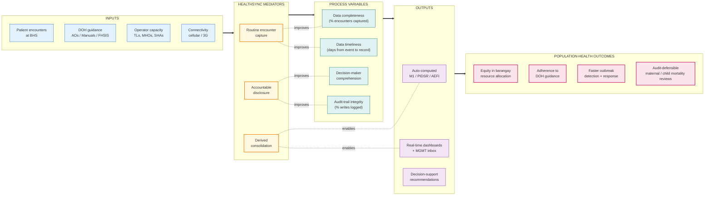

# HealthSync — Conceptual Framework

A theoretical articulation of HealthSync's design — the constructs it
operationalizes, the mechanisms by which it produces better population-health
outcomes, and the variables by which its success can be measured.

This document complements the engineering-side `methodology.md` and the
narrative `use-case.md`. It is written for **LGU leadership, DOH evaluators,
donors, accreditation bodies, and research collaborators** — readers who need
to understand *why* the system is designed this way before judging *what* it
does.

---

## 1. Problem statement

In rural Philippine LGUs, primary-care reporting is **a translation problem,
not a data problem**. The data exists — every encounter at a Barangay Health
Station (BHS) generates a record. What's missing is the chain that converts
those records into:

1. **Mandated reports** (FHSIS Form M1, PIDSR, AEFI) — currently re-keyed
   monthly from paper logs into spreadsheets, with predictable transcription
   error.
2. **Decision-ready signals** for non-clinical leadership (Mayor, Sangguniang
   Bayan Health Committee) — currently inaccessible without a clinician
   translator.
3. **Auditable workflow records** showing who acted on which signal, when,
   and based on which DOH guidance — currently held in a mix of paper logbooks,
   nurse memory, and verbal tradition.

These gaps produce three downstream harms: **late M1 submissions** (which
delay budget allocation), **inequitable barangay attention** (squeaky-wheel
allocation rather than data-driven), and **audit-trail erosion** (which
weakens MDR / CDR review effectiveness and exposes the LGU to liability).

HealthSync exists to close those three gaps.

---

## 2. Theoretical foundations

The framework draws on four established models:

### 2.1 Donabedian's Structure–Process–Outcome model

Donabedian (1988) frames health-system quality as a chain:

> **Structure** (resources, staff, equipment) → **Process** (what is done in
> care) → **Outcome** (what happens to populations).

HealthSync targets the **process** layer — making the *doing* of care
captureable, reviewable, and reportable. Structure (BHS facility standards)
and outcome (M1 indicators) are inputs and outputs respectively, not the
intervention itself. The system improves outcomes by making the process
visible and accountable.

### 2.2 DeLone & McLean Information Systems Success model

The IS Success model (DeLone & McLean, 2003) identifies six dimensions a
clinical information system must score on for sustained adoption:

1. **System quality** — uptime, performance, mobile-friendliness.
2. **Information quality** — accuracy, timeliness, completeness.
3. **Service quality** — support, training, glossary, plain-language layer.
4. **Use** — frequency and breadth of operator interaction.
5. **User satisfaction** — does it reduce or add to nurse workload?
6. **Net benefits** — population-health outcomes, decision-quality at LGU.

Every architectural choice in HealthSync (cellular performance, role-based
defaults, audit-first design) maps to at least one of these.

### 2.3 Primary-care surveillance as a tiered hierarchy

Public-health information in the Philippines flows along a fixed hierarchy:

> **Barangay Health Station (BHS)** → **Rural Health Unit (RHU)** →
> **Provincial Health Office (PHO)** → **Center for Health Development (CHD)**
> → **DOH Central Office.**

Each tier captures, reviews, signs off, and forwards. HealthSync deliberately
mirrors this hierarchy in role-based access (TL → MHO → MAYOR /
HEALTH_COMMITTEE) rather than flattening it into a single "user" role. This
preserves the locus of clinical responsibility (the MHO signs the M1) while
making upstream tiers visible to downstream consumers.

### 2.4 Clinical decision-support theory

Decision-support systems (DSS; Berner, 2007) work when guidance is
**actionable, citable, and trusted**. HealthSync's recommendation engine
(design proposal) follows the DSS literature:

- **Rule-based first** (deterministic, citable, offline-capable).
- **LLM-augmented second** (plain-language summary alongside the rule).
- **Mandatory disclaimers** ("DOH guidance — reviewer judgment required").
- **Human-in-the-loop** for every status transition (no autonomous action).

These constraints reflect the lessons from prior clinical-DSS rollouts where
unconstrained automation eroded trust.

---

## 3. The conceptual model

Three core constructs link inputs to outcomes through HealthSync.

### 3.1 The constructs

| Construct | What it represents | Where in the system |
|---|---|---|
| **Routine encounter capture** | Every BHS interaction with a patient produces a structured record once, at the point of care. | TL worklists, registry pages, action drawers. |
| **Derived consolidation** | Mandated reports and signals are pure functions of operational records — never re-keyed. | `computeM1Values`, `m1_indicator_catalog × m1_indicator_values`. |
| **Accountable disclosure** | Every transition is audit-logged; every term used in a UI surface has a plain-language definition with a DOH source citation. | `audit_logs`, `<Term>` + `shared/glossary.ts`, recommendation rules. |

### 3.2 The conceptual model — diagram

**Reading the diagram:** the outer five boxes are the standard *Input →
Mediator → Process → Output → Outcome* logic chain from program-evaluation
theory. HealthSync sits in the **Mediators** layer — it does not produce
encounters, generate DOH guidance, or determine outcomes directly. It
operates on the process variables that link inputs to outputs to outcomes.

The dotted lines map specific mediator → process pairs:
- *Routine capture* → *completeness + timeliness*.
- *Derived consolidation* → *auto-computed reports + real-time dashboards*.
- *Accountable disclosure* → *decision-maker comprehension + audit integrity*.

---

## 4. Variables and operationalization

Each construct is operationalized through measurable variables. Most are
already instrumented in the audit log + value-source columns; a few
(decision-maker comprehension) need explicit instrumentation.

### 4.1 Input variables

| Variable | Operational definition | Measurement source |
|---|---|---|
| Encounter volume | Count of records created in `mothers + children + seniors + disease_cases + …` per month per barangay | Operational tables. |
| DOH-guidance currency | Days since most recent applicable AO / Manual was reviewed | `doh_updates.published_date` + (future) rule-version stamp. |
| Active operator FTE | Distinct user IDs with `role = TL` writing in the past 30 days | `audit_logs`. |
| Median connectivity | RUM-style page-load timing per barangay | (Future instrumentation; not yet in scope.) |

### 4.2 Process variables (the proximate measures)

| Variable | Operational definition | Target |
|---|---|---|
| **Data completeness** | (Records captured) / (Records expected, per DOH cadence) | ≥ 90% per indicator per barangay per month. |
| **Data timeliness** | Median days between event date and record `created_at` | ≤ 3 days. |
| **Decision-maker comprehension** | Self-reported confidence on a per-survey basis (proposed); proxy: glossary-popup-tip impression rate among MAYOR / HEALTH_COMMITTEE roles | (Baseline TBD; tracked via `audit_logs` action `GLOSSARY_TIP_VIEWED`.) |
| **Audit-trail integrity** | Records with at least one corresponding audit-log entry / total records | 100% (any gap = bug). |

### 4.3 Output variables

| Variable | Operational definition |
|---|---|
| Auto-computed indicators | Count of M1 rowKeys with `valueSource = 'COMPUTED'` per report. Goal: maximize relative to `'ENCODED'`. |
| Real-time dashboards | Page-load latency on `/dashboards` and `/mgmt-inbox`. |
| Recommendation impressions | Count of audit-log entries with `action = 'RECOMMENDATION_SHOWN'`. |
| Recommendation acted-on rate | Share of impressions followed by a status transition by the same user within 24h. |

### 4.4 Outcome variables (distal — public-health impact)

These are **not measurable inside HealthSync** — they require external
evaluation against population-health datasets. HealthSync produces the
process and output variables that *enable* these outcomes.

| Outcome | Plausible mechanism | External measurement |
|---|---|---|
| Equity in barangay allocation | Real-time dashboards make under-served barangays visible to LGU leadership monthly, not yearly. | LGU budget allocation patterns; service-coverage equity index. |
| Adherence to DOH guidance | Recommendation engine surfaces the cited next step at the moment of decision. | Audit of randomly-sampled cases against AO checklists. |
| Faster outbreak detection | Cluster signals surface in MGMT inbox the day they cross threshold. | Time from first-case to RRT-dispatch (compare pre / post). |
| Audit-defensible MDR / CDR / PDR | Every state transition logged; reviewer notes preserved. | DOH MDR review audit pass rate. |

---

## 5. Theory of change

HealthSync's theory of change has **four causal links**, each empirically
testable:

### Link 1 — Capture once → Completeness up

When operators capture data once at the point of care (via a worklist UI on
their phone), instead of re-keying paper logs at month-end, **data
completeness goes up** because:
1. The record is created when memory is freshest.
2. The cost of capture is lower than the cost of re-creation.
3. The operator sees immediate value (the worklist refreshes).

**Testable hypothesis:** monthly data completeness rate increases by ≥ 15
percentage points within 90 days of HealthSync rollout per barangay.

### Link 2 — Derive don't duplicate → Timeliness up + transcription error down

When the M1 report is computed from operational data instead of re-keyed,
**timeliness improves and transcription error drops to zero** for the auto-
computed indicators. The M1 cycle's bottleneck shifts from end-of-month data
entry to end-of-month review + sign-off, which is faster.

**Testable hypothesis:** median M1 submission lag decreases from
~10 days post-cycle-close to ≤ 3 days within 60 days of rollout.

### Link 3 — Plain-language disclosure → Decision-maker comprehension up

When non-clinical leadership (Mayor, Health Committee) can read the same
surfaces as clinicians without a translator — because every term has a
glossary popup or inline gloss — **decision-maker comprehension goes up**.
This means:
1. Quarterly review sessions have substantive discussion, not jargon
   confusion.
2. Budget allocation reflects what the data actually says.
3. The Sangguniang Bayan Health Committee can challenge the MHO with
   informed questions.

**Testable hypothesis:** per-quarter LGU-leadership engagement (measured by
session duration, questions asked, resolutions filed) increases relative to
the pre-HealthSync baseline.

### Link 4 — Audit-trail integrity → Accountable governance

When every state transition (especially clinical: status changes on
surveillance, MDR review status, AEFI causality assessment) is logged with
user, role, timestamp, and before/after state, **clinical governance becomes
auditable**. Accountability shifts from "the nurse remembers" to "the system
records."

**Testable hypothesis:** DOH MDR audit pass rate reaches 100% within one
review cycle.

---

## 6. Cross-cutting equity dimensions

A health information system can perpetuate inequity if it favors well-resourced
barangays. HealthSync's design includes explicit equity safeguards:

### 6.1 Connectivity equity

Initial-paint optimization (route-based code-splitting reduces gzip from
814 KB → 143 KB) means a TL on EDGE / poor 3G has comparable interactive time
to a TL on fiber. **Without this, the system would silently exclude operators
in the worst-connected barangays.**

### 6.2 Linguistic equity

The plain-language layer (`<Term>` + glossary) defaults to **inline
disclosure for viewer roles** — Mayor + Health Committee — so that political
oversight is accessible without medical training. Bilingual readiness
(`short_fil` field structure, no schema change required) is built in for
when Filipino translation is funded.

### 6.3 Workload equity

The capture-once principle reduces the marginal cost of routine encounters
on the TL. The system specifically does NOT add reporting work in exchange
for benefits delivered to upstream tiers — the M1 cycle gets faster *for the
TL too*, not just for the MHO.

### 6.4 Decision-quality equity

Recommendation rules cite DOH sources publicly, so a TL in a barangay with no
visiting MHO has the same checklist as a TL adjacent to the RHU. The
recommendation engine deliberately does not vary content by location; only
the presence of the recommendation card varies (it appears when a row matches
the rule predicate).

---

## 7. Limitations of this framework

A conceptual framework should be honest about its boundaries.

1. **HealthSync mediates process, not structure or outcome.** Improvements
   in BHS facility standards (medicines, equipment, staffing) are
   prerequisites — the system cannot compensate for absent inputs.
2. **The theory of change assumes operator adoption.** A system that captures
   nothing produces no benefit. Adoption strategy (training, change
   management, incentives) sits outside the framework but is necessary for
   any of the causal links to fire.
3. **Outcome-level claims are external to the system.** HealthSync produces
   process and output variables; population-health outcomes require external
   evaluation against vital-statistics data.
4. **The framework is provincial-level scope today.** Multi-province /
   regional aggregation is a separate initiative (see `roadmap.md`).
5. **Bilingual support is structurally ready but not implemented.** Filipino
   translation requires funded translator effort; the data model accommodates
   it without rework.

---

## 8. Evaluation framework — how to know it's working

| Time horizon | Evaluation question | Method |
|---|---|---|
| **Month 1–3** | Does the system run? Operators logging in? Pages loading on cellular? | RUM, audit-log volumes, helpdesk tickets. |
| **Month 3–6** | Is data completeness improving? Are M1 submissions on time? | Pre/post comparison of completeness rates and submission lag. |
| **Month 6–12** | Are decision-makers using the dashboards? Is the inbox driving action? | Login frequency by role, time-from-escalation-to-resolution. |
| **Year 1+** | Are population-health outcomes improving? | External evaluation against vital-statistics + service-coverage data. |

Each horizon's findings inform the next phase of design. The conceptual
framework is itself revisable: if Link 3 (plain-language disclosure →
decision-maker comprehension) fails to fire, the response is to redesign the
disclosure layer, not to abandon the construct.

---

## 9. Synthesis

HealthSync operationalizes a simple proposition: **a clinical information
system that mirrors the operational hierarchy, captures encounters once,
derives every report and signal, and discloses every term and decision in
plain language with audit trails — produces measurable improvements in data
completeness, M1 timeliness, decision-maker comprehension, and audit-trail
integrity. Those process gains are the proximate cause of population-health
outcomes that DOH and LGU leadership care about.**

The conceptual framework's value is **falsifiability**. Every link in the
theory of change is testable; every variable is operationally defined; every
construct has a measurement source. If the data shows a causal link is not
firing, the design changes — not the theory.

That is the framework.
