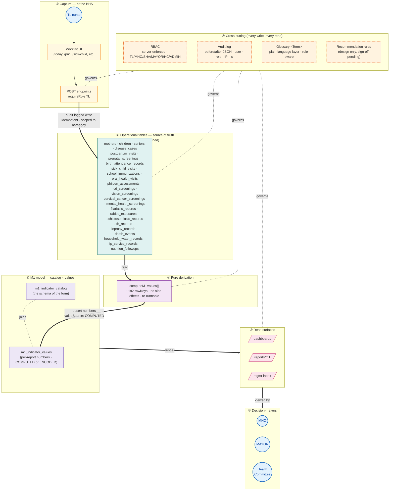

# HealthSync — System Methodology

How HealthSync is designed and built. Captures the principles a new
contributor needs in their head before they touch code, the patterns we
reach for repeatedly, and the guardrails that keep clinical software safe.

Companion to:
- `docs/use-case.md` — what users do.
- `docs/use-case-diagram.md` — who does what.
- `docs/m1-data-source-audit.md` — what indicators we cover.
- `docs/roadmap.md` — what's queued.
- `docs/ai-recommendations-design.md` — design proposal awaiting sign-off.

This doc covers the engineering side: **how the codebase is meant to grow.**

---

## Figure 1 — The methodology at a glance

The picture below is the most important thing in this doc. The *whole*
methodology compresses into "data flows in once at the BHS, the M1 report
emerges as a pure derivation, and four cross-cutting concerns govern every
write." Everything else is implementation detail.



**Reading the figure:**

- **Solid arrows (`==>`)** are the one-way data flow: capture → operational
  tables → compute → M1 model → read surfaces → decision-makers. Data flows
  *in* at the BHS and *up* to the LGU.
- **Dotted lines** mark the cross-cutting layer — RBAC, audit, glossary, and
  the (proposed) recommendation rules govern every step on the linear path.
- **Numbered subgraphs** map to the principles in the prose below: ① + ② =
  §1.2 (operational hierarchy) + §1.3 (one-way flow); ③ + ④ = §2.1
  (catalog-driven) + §2.2 (compute as derivation); ⑤ + ⑥ = §1.2 (read
  surfaces); ⑦ = §1.4 (audit-first), §1.5 (RBAC), §2.7 (plain-language),
  §6 (safety guardrails).
- **Per-domain tables** in ② are listed in full to make a point: when a new
  domain shows up, it gets a *new* table on this list, not new columns on an
  existing one (§2.3).

If you remember nothing else from this doc, remember this: **every line of
clinical code in HealthSync sits on one of these arrows or inside one of
these boxes.**

---

## 1. Foundational principles

### 1.1 DOH-first, not engineering-first

Every clinical decision in code traces to a DOH document — AO, manual, FHSIS
form, or memorandum. We don't invent indicators or workflows; we encode the
ones that the Department of Health has published. When we deviate (e.g. coarse
age-band approximations, or M1 catalog entries that pre-date a UI), we say so
in code comments + the audit doc.

**In practice:**
- `shared/glossary.ts` entries cite their source DOH document where
  operationally important (`source: "DOH 2018 Rabies Manual"`).
- `docs/ai-recommendations-design.md` rules each cite an AO / Manual.
- M1 row labels in the catalog seeders match the FHSIS PDF verbatim.

### 1.2 Mirror the operational hierarchy

HealthSync's data flow mirrors the real public-health hierarchy:

```
Barangay Health Station (BHS)  →  Rural Health Unit (RHU)  →  LGU Decision-makers
        ↑ TL captures                  ↑ MHO/SHA review              ↑ Mayor / Health Committee oversee
```

Roles, scoping, and surfaces are designed around this. A TL writes; an MHO
reviews + escalates + signs off; a Mayor reads. We don't blur the lines:
viewer roles can never trigger a state transition, and the server enforces
this regardless of what the UI shows.

### 1.3 Operational data → M1 indicators (one-way)

The M1 report is the *consolidated view*, never the source of truth. Every
indicator is a function of operational data captured during routine work —
prenatal screenings the nurse logs after an ANC visit, vaccinations she ticks
off after the jab, deaths the registrar records when they happen. The M1
report computes itself from those records. Operators never re-key M1 numbers
they've already entered elsewhere.

This is encoded in `server/storage.ts:computeM1Values`, which reads only from
operational tables (`mothers`, `children`, `seniors`, `disease_cases`,
`postpartum_visits`, etc.) and writes to `m1_indicator_values`. Compute is a
*pure derivation*. Encoded values exist as an override fallback only; they're
flagged `valueSource: "ENCODED"` so reviewers know which numbers came from
automation.

### 1.4 Audit-first

Every state-changing endpoint calls `createAuditLog(userId, role, action,
entityType, entityId, before, after, req)`. This is non-negotiable for
clinical software. The audit log is what makes:

- **Liability defensible** — "who said what, when, and why?"
- **Quality measurable** — adherence to recommended actions, response times.
- **Rollback safe** — diffing before/after JSON of any row.

If a write endpoint doesn't write an audit log, it's a bug.

### 1.5 Role-based, server-enforced

`shared/models/auth.ts` is the single source of truth for roles
(`SYSTEM_ADMIN`, `MHO`, `SHA`, `TL`, `MAYOR`, `HEALTH_COMMITTEE`). Every
endpoint enforces RBAC server-side via `requireRole(...)`. The client mirrors
this with the `permissions` helpers in `client/src/hooks/use-auth.ts`, but the
server is the gate. Hiding a button doesn't make a write impossible — the
server `requireRole` does.

**Corollary:** view-only roles (MAYOR, HEALTH_COMMITTEE) get the full MGMT
read surface but every transition endpoint rejects them. Their permission
shape is defined explicitly in `MGMT_VIEW_ROLES` vs `MGMT_ROLES`.

---

## 2. Engineering patterns we reach for

### 2.1 Catalog-driven rendering

The M1 form renders by iterating `m1_indicator_catalog` rows (the
schema-of-the-form) and joining `m1_indicator_values` (the data). This means:

- **Adding a new indicator = one catalog row + maybe a compute extension.**
- **The renderer is dumb;** it doesn't know what indicators exist until the
  catalog tells it. No catalog row → no UI row, regardless of values present.
- **Encoders and viewers see the same shape** because they read the same
  catalog.

**Anti-pattern:** hardcoding indicator labels / row layouts in the renderer.
We hit this once with "ghost-computed" rowKeys (compute writing values to
rowKeys with no catalog entry — silently dropped by the renderer). Fixed by
PRs #161-#163 which backfilled 44 catalog entries.

### 2.2 Compute as derivation

`computeM1Values` is a pure function of operational tables. We never store
M1 numbers as a primary record; they're recomputed every time a report is
opened. This means:

- A bug fix in compute fixes every historical report.
- A backfill of operational data automatically updates M1.
- We never have a "M1 value diverged from underlying data" inconsistency.

### 2.3 Per-domain tables, not column-widening

When a new clinical domain shows up (postpartum visits, prenatal screenings,
sick child visits), we add a new table. We don't widen `mothers` with
twenty new columns. This:

- Keeps schema readable and per-domain reasoning local.
- Lets one phase's PR not block another's (no two phases share new tables).
- Mirrors how DOH thinks about programs (each program is its own register).

This is a project decision documented in `docs/m1-data-source-audit.md` Part
2; phase 1-7 each gets its own table.

### 2.4 Idempotent migrations

`seedData()` runs every server boot. Every statement inside must be
idempotent: `ALTER TABLE ... ADD COLUMN IF NOT EXISTS`, `CREATE TABLE IF NOT
EXISTS`, insert-if-absent. This means:

- Restart-safety on existing deployments.
- No need for separate migration runner / lock table for additive changes.
- Replit's restart loop in `dev.sh` Just Works.

**Lesson learned (PR #185):** adding a `pgTable` to the schema does *not*
auto-create the table on existing databases — Drizzle relies on
`drizzle-kit push` for that. Every new table now lands with a corresponding
`CREATE TABLE IF NOT EXISTS` in `seedData()`.

### 2.5 Status spine for workflow

When a row needs more than "exists / doesn't exist" semantics, we add a four-
column status spine:

```
status              text default 'REPORTED'
reviewer_notes      text
reviewed_at         timestamp
reviewed_by_user_id varchar
```

The status enum (e.g., `REPORTED → REVIEWED → ESCALATED → CLOSED`) drives the
UI badge color and the MGMT inbox feed. PR #176 applied this to all 5 disease
surveillance modules in one shot — same schema, same PATCH endpoint pattern,
same drawer component.

### 2.6 Source-cited rules

Recommendation rules (per the design proposal) and glossary entries carry an
optional `source` field that cites a DOH document. This means:

- Auditors can verify the rule matches current DOH guidance.
- Operators can click through to the source.
- Quarterly review cadence: open every rule, confirm citation is current,
  retire (don't edit) any that are stale.

### 2.7 Plain-language layer

`<Term name="MAM" />` is the universal jargon-disclosure primitive. Reads
from `shared/glossary.ts`. Renders one of two shapes per user preference:
inline gloss or `?` popup tip. Falls back to plain text if the term isn't
defined — the UI is never broken by a typo.

**Default-by-role:** viewer roles (MAYOR, HEALTH_COMMITTEE) get inline mode
ON; power roles get the discreet `?`. Any user can flip in Account →
Display.

This honors NN/g's first rule: "don't put task-vital info in tooltips" — for
viewers who *need* the definition, it's visible inline; for power users, it's
one click away.

---

## 3. Performance principles

HealthSync runs on rural Philippine cellular. Every architectural decision
has cellular as the worst-case test.

### 3.1 Code-split everything routable

Every page in `App.tsx` is a `React.lazy()` import behind a `Suspense`
boundary (PR #177). Initial bundle is **143 KB gzipped** (down from 814 KB);
each route is a separate chunk loaded on first navigation. First paint on 3G
went from ~3.3s to ~0.6s.

**Lesson learned (post-PR #177):** the unauthenticated landing path needs
its own Suspense boundary too. Caught + fixed in commit `3170efa`.

### 3.2 Batch-fetch over N+1

When a list page has per-row data, we batch (PR #168). A worklist with 10
rows fetches the per-row data in **one** GET (`?motherIds=1,2,3,...`),
not ten. The server endpoint accepts both singular (`?motherId=N`) and
plural (`?motherIds=...`) for back-compat.

The client builds a `Map<id, T[]>` and renders rows from props instead of
each row issuing its own `useQuery`.

### 3.3 Pagination at 10 / page

Standard `usePagination` hook + `TablePagination` component. Worklists
default to 10 / page; pagination resets to page 1 when filter / search
changes. Per-row fetches are bounded by the pagination size.

### 3.4 React Query for server state

`@tanstack/react-query` for every server fetch. Cache invalidation uses
**prefix invalidation** when multiple key shapes need to be refreshed
together — e.g. `queryClient.invalidateQueries({ queryKey:
["/api/postpartum-visits"] })` after a create bumps every postpartum-visits
key under that prefix.

---

## 4. UI patterns

### 4.1 Worklist-first

Pages are organized around "what do I do today?", not "browse all records."
The TL's `/today` shows priorities. `/pnc` shows mothers due for postpartum
visits today. `/sick-child` shows children eligible for IMCI. Records the
operator doesn't need to see right now stay out of the way.

### 4.2 Action drawer

When a row needs a workflow (status transition + notes + audit), it opens
an action drawer rather than a separate edit page. Drawer is reusable across
modules (`<SurveillanceActionDrawer />` is shared across all 5 disease
programs).

### 4.3 Status badge

Every row with a status spine renders a `<StatusBadge status={status} />`.
Color tone maps to severity:
- `secondary` (gray) — REPORTED.
- `default` (blue) — REVIEWED.
- `destructive` (red) — ESCALATED.
- `outline` — CLOSED.

The badge wraps the status text in `<Term>` so a click reveals the
plain-language definition.

### 4.4 Empty state with friendly copy

When a list is empty, we explain *why* and *what to do*. Not just "No
records." We explain: "No mothers in the recent-delivery window. When a TL
logs a delivery, it will appear here." (Many of these still need work — see
roadmap.)

---

## 5. Development process

### 5.1 Small, focused PRs

Each PR has one concern. Schema migration, storage method, API endpoint,
UI surface — those are separable concerns; a feature is usually 2-4 PRs
chained, not one giant. Small PRs:

- Are easy to review (or auto-merge with low risk).
- Are easy to revert (`git revert <merge-sha>` is one command).
- Are easy to back-read for the user when they're back.

### 5.2 Auto-merge cycle

After every push: type-check → production build → contract walkthrough
(routes / storage / endpoints / queryKeys / role gates) → commit → push →
PR (ready, not draft) → auto-merge → post-merge QA on main.

Auto-merge skips the user's chance to review. We compensate with:
- **Conservative PR scope** (small, focused, additive).
- **Pure-additive only** (no existing-table column adds, no compute
  semantic changes, no breaking API changes).
- **Doc PRs for risky decisions** (recommendation engine, multi-tenant —
  these go through design review before code).
- **Risk callouts in the PR body** (auto-merge "skips your chance to
  review the diff before it hits main" was the framing).

### 5.3 Doc-first for risky changes

Anything that changes clinical guidance, modifies an existing-table schema,
or introduces a multi-week initiative gets a design doc (markdown) merged
to `docs/` first, with sign-off questions. Code only after sign-off.

This produced `docs/ai-recommendations-design.md`. It's still draft; we
won't write the recommendation engine until the user answers the questions.

### 5.4 Phase-based roadmap

`docs/m1-data-source-audit.md` defines 8 roadmap phases (0 through 7).
Phases were sequenced by clinical impact + data-model independence (so
phases don't block each other). Status of each phase tracked in the audit
doc + roadmap doc.

### 5.5 Idempotent everything

Every seeder, every migration, every catalog insert: idempotent.
Re-running it is a no-op. This means the dev loop is fast (no DB resets),
the deploy loop is safe (Replit restarts don't break things), and Phase
PRs can land in any order after Phase 0.5.

### 5.6 Type-check + build as the floor

Pre-existing: 38 TypeScript errors in `server/routes.ts`,
`server/storage.ts`, and a few client files. We never increased that
baseline this session. **Every PR's QA step:** confirm error count is
unchanged.

`npm run build` always runs. Any chunk-size warning gets called out in
the PR body. PR #177 cut initial bundle 5×; m1-report internal split is
queued.

---

## 6. Safety guardrails

### 6.1 Mandatory disclaimers on AI / recommendation surfaces

Every recommendation card carries: *"DOH guidance — reviewer judgment
required."* Not in a tooltip; visible in the card footer. Non-negotiable.

### 6.2 No autonomous clinical actions

The recommendation engine never fires a write endpoint on its own. It tells
the reviewer which existing workflow action (Mark Reviewed / Escalate /
Refer) is most aligned with DOH guidance — but the reviewer must click.

### 6.3 Human-in-the-loop for rule changes

If we add a DOH-update scraper (Phase 1+2 of the AI design proposal), the
scraper writes new memos to `doh_updates`. It **never** modifies
`shared/recommendations.ts` or `shared/glossary.ts`. Rule changes go
through PR review.

### 6.4 Rules retired, not edited

When DOH publishes new guidance that supersedes an existing rule, we add a
new rule with a new id and deprecate the old one — we don't edit in place.
Audit log integrity is preserved.

### 6.5 Source citation visible

Every glossary entry with operational impact has `source:`. Every
recommendation has `source:`. Cited at point of use, not buried in a
footnote.

### 6.6 Bilingual-ready data shapes

Glossary entries and recommendation rules can carry `short_fil` / `long_fil`
fields without schema changes. We default to English for now; Filipino
translation is a separate initiative when ready.

---

## 7. What "feature complete" means

A feature is complete when:

1. **Schema:** Drizzle table defined + migration in `seedData()`.
2. **Storage:** read + write + (optional) batch methods on `IStorage`.
3. **API:** GET (read, role-scoped) + POST (write, role-gated) + audit log.
4. **UI:** worklist + action drawer + form, all keyboard- and touch-
   accessible.
5. **Permissions:** server-enforced + mirrored in `permissions` helpers.
6. **Catalog:** every M1 rowKey it drives has a catalog entry.
7. **Compute:** `computeM1Values` writes the indicators when applicable.
8. **Glossary:** every jargon term has an entry.
9. **Tests:** [aspirational — no test suite yet, see §8.1].
10. **Docs:** audit doc updated; use case if the workflow is novel.

PRs are merged when they satisfy 1-8 + 10. (No 9 — see below.)

---

## 8. Known limitations + how we handle them

### 8.1 No automated test suite

No `npm test` script exists in the project. Verification is TS check +
build + manual contract walkthrough. We compensate by:

- **Conservative PR scope** (small, additive, low blast radius).
- **Type-check baseline** as the regression floor.
- **Idempotent seeders** so re-running is safe.
- **Audit log** as the after-the-fact "what changed" record.

This is a real limitation. A test suite is a queued initiative.

### 8.2 Pre-existing TS errors

`server/routes.ts` has untyped req/res parameters (TS7006); 3 schema-
mismatch errors in `server/storage.ts`; one in `server/auth.ts`. Net 38
errors. These predate this session. We don't fix them in feature PRs;
they'd need their own dedicated cleanup PR.

### 8.3 No request rate-limiting

No throttle on any API endpoint. A misbehaving client could hammer the
batch-fetch endpoints. Acceptable for closed-deployment LGU use today;
will need limiter if/when SaaS expansion happens.

### 8.4 No background job runner

Scheduled jobs (the future DOH-updates scraper, MDR-due-date reminders)
need a runner. Today: none. Plan: lightweight `setInterval` in server
bootstrap is sufficient for weekly tasks; a real queue (BullMQ / pg-boss)
when we have ≥3 scheduled jobs.

---

## 9. Decision log — reach for these patterns

| Situation | Reach for |
|---|---|
| New clinical domain | New `pgTable` + per-domain page + `<Term>` for jargon. Don't widen existing tables. |
| New M1 indicator | Catalog row + (compute extension if derivable) + glossary entry for the rowKey. |
| New workflow on existing rows | Status-spine 4-column add + PATCH endpoint + action drawer. |
| New jargon | `shared/glossary.ts` entry with `source` if operationally important. |
| Risky / multi-week initiative | Doc PR first, sign-off questions, code after. |
| Schema change to existing table | Pause — get user sign-off; column adds with `IF NOT EXISTS`. |
| Performance issue | Profile first, then code-split / batch / paginate. Don't pre-optimize. |
| Recommendation rule | Citable DOH source mandatory; severity tier explicit; no autonomous action. |

---

## 10. The methodological summary

HealthSync is a **rule-following system, not a clever one.** Its competence
comes from faithfully encoding DOH guidance, mirroring real public-health
hierarchy, and capturing operational data once so it produces M1 indicators
automatically. The rules + the audit log are what let the system be trusted
in clinical use; the cellular performance + role-based scoping are what let
it be useful in rural Philippines.

When a contributor proposes something clever, we ask: does it match a DOH
document? Does it preserve the audit trail? Can a barangay nurse use it on
3G? Will an MHO trust the numbers?

If yes — ship it small. If no — write a design doc first.

That's the methodology.
