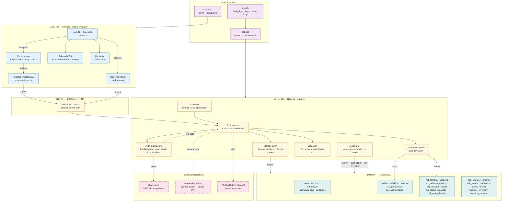

# HealthSync — System Architecture

Technical / structural complement to `methodology.md` (engineering principles)
and `conceptual-framework.md` (theoretical foundations). This document
describes **how the system is physically assembled** — the technology stack,
component boundaries, data layer, deployment topology, and the architectural
decisions that produced them.

Readers: developers, infrastructure engineers, security reviewers, and any
auditor who needs to verify that the design described in
`methodology.md` is actually implemented this way.

---

## Figure 1 — System architecture at a glance



---

## 1. Technology stack

### 1.1 Client tier
| Layer | Technology | Version | Why |
|---|---|---|---|
| Language | TypeScript | 5.x | Strict typing of API contracts via shared schema. |
| UI runtime | React | 18.3.1 | Industry standard; large ecosystem. |
| Bundler | Vite | 7.3.0 | Fast dev server; predictable production builds. |
| Router | Wouter | 3.3.5 | Tiny (~1.5KB) router; chosen over React Router for cellular bundle size. |
| Server state | TanStack React Query | (latest) | Cache invalidation + suspense + optimistic updates without bespoke Redux. |
| Forms | react-hook-form + zod | — | Schema-driven forms; same Zod schemas drive server validation. |
| Styling | Tailwind CSS 3.4 + shadcn/ui (Radix) | — | Headless components mean accessibility comes for free; Tailwind keeps the build small. |
| Charts | Recharts | 2.15 | Dashboard visualizations; lazy-loaded so it doesn't hit non-dashboard routes. |
| Code-splitting | React.lazy + Suspense | — | Each route is its own chunk (PR #177). |

### 1.2 Server tier
| Layer | Technology | Why |
|---|---|---|
| Runtime | Node.js | Standard for full-stack TS. |
| HTTP | Express 4 | Conservative, well-understood; chosen over Fastify for ecosystem maturity. |
| ORM | Drizzle 0.39 | Type-safe SQL; schema-as-code via `pgTable()`. |
| Validation | Zod 3 + drizzle-zod | Insert/update schemas auto-derived from table definitions. |
| Auth middleware | Custom over Replit Auth | `loadUserInfo + requireAuth + requireRole(...)` chain. |
| Build | esbuild | Single CommonJS bundle (`dist/index.cjs`), ~1.6MB. |

### 1.3 Data tier
| Component | Technology | Notes |
|---|---|---|
| Database | PostgreSQL | Relational; chosen over Mongo because clinical data has strong relational shape (FK between mothers ↔ children ↔ postpartum_visits etc.). |
| Migration strategy | Idempotent in-app | `seedData()` runs `ALTER ... ADD COLUMN IF NOT EXISTS` and `CREATE TABLE IF NOT EXISTS` on every boot. No separate migration runner. |
| Connection | Pooled via Drizzle's pg client | Standard; no special config. |

### 1.4 External integrations
| Integration | Status | Notes |
|---|---|---|
| Replit Auth | Live | OIDC identity; HealthSync extends with role + KYC fields in `users` table. |
| `caraga.doh.gov.ph` scraper | Design only | Phase 1 of `ai-recommendations-design.md`. Awareness-only; never auto-modifies rules. |
| PhilHealth Konsulta | Stub | Enrollment + encounter scaffolding present; production integration TBD. |

---

## 2. Component architecture

### 2.1 File-system layout

```
Unified-Health-Sync/
├─ client/src/
│  ├─ pages/             — one file per route (~70 files; lazy-loaded)
│  ├─ components/
│  │  ├─ ui/             — shadcn primitives (button, card, dialog, …)
│  │  ├─ today/          — /today-page widgets (DayBannerStrip, M1ProgressStrip)
│  │  ├─ states/         — empty / loading / error skeletons
│  │  └─ *.tsx           — feature components (term, doh-updates-card,
│  │                       surveillance-action-drawer, glossary-tip-banner, …)
│  ├─ hooks/             — useAuth, useBarangay, usePagination, useGlossaryPreference, …
│  ├─ contexts/          — BarangayProvider, ThemeProvider
│  ├─ lib/               — queryClient, healthLogic, utils, severity
│  └─ App.tsx            — routes + role-aware redirects
│
├─ server/
│  ├─ routes.ts          — every API endpoint (one big file by design)
│  ├─ storage.ts         — IStorage interface + Drizzle queries + seedData
│  ├─ auth.ts            — Replit Auth wiring + /api/auth/me
│  ├─ middleware/rbac.ts — loadUserInfo + requireAuth + requireRole
│  ├─ reports/           — M1 + M2 report generators
│  ├─ replit_integrations/ — Replit-specific (image, batch, auth)
│  ├─ scheduler.ts       — periodic tasks (lightweight)
│  └─ index.ts           — Express bootstrap
│
├─ shared/
│  ├─ schema.ts          — Drizzle pgTable defs + Zod insert schemas (~2,300 LOC)
│  ├─ models/auth.ts     — users / sessions / barangays / userBarangays / auditLogs
│  ├─ models/chat.ts     — conversations + chat_messages
│  ├─ glossary.ts        — plain-language definitions (~85 entries)
│  └─ routes.ts          — typed API contract (paths + zod schemas)
│
├─ docs/                 — methodology, use-case, audit, roadmap, conceptual-framework, …
├─ scripts/              — one-off operational scripts
├─ tests/                — (placeholder; no automated suite yet)
├─ dev.sh                — restart loop with build_if_missing
└─ drizzle.config.ts     — Drizzle config
```

### 2.2 Module boundaries

The codebase has three clear strata:

1. **`shared/`** — types, schemas, glossary. **Imported by both client and
   server.** Anything cross-cutting lives here.
2. **`server/`** — API + business logic + data access. Imports only from
   `shared/`.
3. **`client/`** — UI + interaction. Imports from `shared/` (types) but
   never from `server/` directly.

This is enforced by Vite's path-alias config and TypeScript paths; violations
produce TS errors at build.

### 2.3 Cross-tier contracts

The shared schema gives us **end-to-end type safety**:

```
shared/schema.ts             ─┐
  ↳ pgTable("mothers", …)    │  Drizzle types
  ↳ insertMotherSchema        │  Zod schema (drizzle-zod)
                              │
server/storage.ts            ◀┘  imports types
server/routes.ts                 imports insertSchema + parses
                                 with .safeParse()

client/src/pages/*           ◀───  imports types
client/src/lib/queryClient   ◀───  uses fetch wrapper
```

A schema column added in `shared/schema.ts` immediately type-errors in any
`storage.ts` query that's missing the column, and in any `pages/*.tsx` that
destructures the type. **There is no schema drift between client and server**
— the same TypeScript types compile both ways.

---

## 3. API architecture

### 3.1 Endpoint pattern

Every clinical endpoint follows the same shape (formalized via the `ncdRoute`
helper for the 11 surveillance/NCD modules):

```ts
app.get(path, loadUserInfo, requireAuth, ar(async (req, res) => {
  // 1. Optional barangay filter via scopedPath()
  // 2. RBAC: TL filtered to assigned barangays; MGMT sees all
  // 3. Storage call (Drizzle)
  // 4. JSON response
}));

app.post(path, loadUserInfo, requireAuth, requireRole(UserRole.TL),
  ar(async (req, res) => {
    // 1. Zod parse via insertSchema.safeParse()
    // 2. Server-side barangay scope check
    // 3. Storage create
    // 4. createAuditLog(...) — non-negotiable
    // 5. 201 Created
  }));
```

### 3.2 RBAC enforcement

The auth middleware chain is `loadUserInfo → requireAuth → requireRole(...)`:

| Middleware | Adds |
|---|---|
| `loadUserInfo` | `req.userInfo = { id, role, assignedBarangays }` |
| `requireAuth` | 401 if not authenticated |
| `requireRole(...roles)` | 403 if user.role not in roles |

Role gates:
- `requireRole(UserRole.TL)` — registry CREATE (mothers, children, surveillance writes).
- `registryRBAC` — read + update endpoints (Admin/MHO/SHA/TL).
- `adminOnlyRBAC` — DELETE + admin pages.

Server-enforced; the UI mirrors with `permissions.canEnterRecords()` etc., but the server is the gate.

### 3.3 Audit log

Every write endpoint calls `createAuditLog(userId, role, action, entityType,
entityId, before, after, req)`. The audit log is the **integrity backbone**.
Non-write endpoints don't write audit logs.

---

## 4. Data architecture

### 4.1 Schema organization

`shared/schema.ts` is one file (~2,300 LOC) with logical sections:

```
1.  Auth + RBAC (re-exported from models/auth.ts)
2.  Operational tables (24 per-domain tables)
3.  M1 catalog/values (the meta-schema for the M1 form)
4.  Programs + governance (referrals, AEFI, outbreaks, deaths, M1 reports)
5.  Inventory + pharmacy
6.  Konsulta (PhilHealth)
7.  Workforce
8.  Walk-in / consults
9.  Cold chain
10. Campaigns + certificates
11. DOH updates
12. FP service records (with FP_METHOD_ROW_KEY map)
13. Global chat
14. Re-export from models/auth.ts + models/chat.ts
```

Per-domain tables are isolated; cross-domain FKs go through `users.id` (for
audit) or `barangays.id` (for scoping), rarely between domains directly.

### 4.2 The catalog/values pattern

The M1 form uses a meta-schema:

```
m1_template_versions  → which version of the M1 form is active?
m1_indicator_catalog  → the schema of the form (rowKey, label, columnGroupType, ...)
m1_indicator_values   → the data (per report, per rowKey, per columnKey)
m1_report_instances   → one per (barangay, month, year)
m1_report_header      → metadata (submitter, signoff timestamp, status)
```

Adding a new indicator = one catalog row. The renderer iterates the catalog;
no UI code change needed.

### 4.3 Audit log table

```sql
audit_logs (
  id          serial primary key,
  user_id     varchar      -- who
  user_role   varchar      -- role at time of action
  action      varchar      -- CREATE / UPDATE / DELETE / SYSTEM_ALERT
  entity_type varchar      -- MOTHER / RABIES_EXPOSURE / M1_REPORT / ...
  entity_id   varchar
  barangay_id serial       -- scope
  barangay_name text
  before_json jsonb        -- state before write
  after_json  jsonb        -- state after
  ip_address  varchar
  user_agent  text
  created_at  timestamp
)
```

Append-only by convention. No DELETE on this table outside admin migrations.

---

## 5. Deployment topology

### 5.1 Current — single-tenant LGU deployment

```
┌─ Replit deployment ──────────────────────────────────────┐
│                                                           │
│   dev.sh ──▶ build_if_missing                            │
│        ──▶ node dist/index.cjs                           │
│                                                           │
│   ┌─ Express app ────────────────────────┐               │
│   │   Routes (REST + auth middleware)    │               │
│   │   Static (dist/public/*)             │               │
│   │   Scheduler (lightweight setInterval)│               │
│   └────────────────┬─────────────────────┘               │
│                    │                                      │
│                    ▼                                      │
│            PostgreSQL (Replit-provisioned)               │
│            seedData runs on every boot                   │
│                                                           │
└───────────────────────────────────────────────────────────┘
```

- **One process per LGU.** No horizontal scaling today.
- **Restart loop** in `dev.sh` recovers from idle-kills (Replit-specific).
- **Build artifacts**: `dist/index.cjs` (server, ~1.6 MB) + `dist/public/`
  (client static assets).
- **Health-check**: HTTP 200 on `/api/health` (configured per Replit
  deployment).

### 5.2 Future — provincial multi-tenant (issue #159)

Architectural changes required for province-level deployment:
- Add `municipalityId` column to every barangay-scoped table.
- New roles: `PHO`, `GOVERNOR`, `PROV_HEALTH_COMMITTEE`,
  `PROV_SYSTEM_ADMIN`.
- RBAC extension: TL → barangay; MHO → municipality; PHO → province.
- Tenant-isolation guarantees on every query (`requireMunicipalityScope`
  middleware proposed).
- Single-tenant deployments stay backward-compatible; tenant column
  defaults to existing single municipality.

This is a multi-PR initiative tracked in `roadmap.md`.

---

## 6. Cross-cutting concerns

### 6.1 Authentication

Replit Auth (OIDC) issues sessions; HealthSync extends with project-level
fields:

```ts
users {
  id (Replit-issued varchar)
  username, passwordHash (legacy fallback)
  role (SYSTEM_ADMIN | MHO | SHA | TL | MAYOR | HEALTH_COMMITTEE)
  status (ACTIVE | DISABLED | PENDING_VERIFICATION | REJECTED)
  + KYC fields (selfie, ID, face-match score)
}
```

Sessions live in the `sessions` table (Replit Auth requirement, not
HealthSync's choice).

### 6.2 Authorization (covered in §3.2)

### 6.3 Audit (covered in §4.3)

### 6.4 Observability

- Server logs via `console.log` (intentionally minimal).
- Client-side errors caught by React error boundaries.
- No APM today; queued post-MVP.

### 6.5 Performance

- **Code-splitting** — every route is a chunk (PR #177). Initial bundle 143
  KB gzip.
- **Batch endpoints** — list pages use `?motherIds=…` to avoid N+1 (PR
  #168).
- **Pagination** — `usePagination` hook + `TablePagination` component;
  default 10/page; resets on filter change.
- **Pure-derivation compute** — re-runnable; no caching needed.
- **Drizzle prepared statements** — implicit via the ORM.

### 6.6 Security

| Risk | Mitigation |
|---|---|
| Auth bypass | Replit Auth + server-enforced session cookies. |
| Privilege escalation | Server `requireRole` on every write endpoint. |
| Cross-barangay data leak | `filterByBarangay()` on every read; `filterMotherIdsByAccess()` for batch endpoints. |
| Audit-log tampering | Append-only by convention; admin DELETE requires explicit confirmation. |
| SQL injection | Drizzle parameterized queries throughout. |
| XSS | React's default escaping; user input never `innerHTML`-ed. |
| CSRF | Session cookies are HTTP-only + SameSite. |
| Rate-limiting | None today (single-tenant LGU; queued for SaaS expansion). |

### 6.7 Plain-language layer

Cross-cutting UI concern, owned by:
- `shared/glossary.ts` — single source of truth.
- `client/src/components/term.tsx` — `<Term name="...">`.
- `client/src/hooks/use-glossary-preference.ts` — per-user toggle.
- `/glossary` page + `GlossaryTipBanner` for discoverability.

Touches every page. Falls back gracefully (plain text) for unknown terms.

---

## 7. Architecture Decision Records (ADRs — abridged)

Compressed log of why the system is the way it is. Full ADRs live in
individual PR descriptions; this is the at-a-glance index.

| # | Decision | Rationale | Trade-off accepted |
|---|---|---|---|
| ADR-1 | TypeScript + shared schema | End-to-end type safety; no API drift. | Compile step required. |
| ADR-2 | Drizzle ORM over raw SQL | Type-safe queries, schema-as-code. | Some Drizzle quirks (insert overload strictness on `$type<…>`). |
| ADR-3 | One big `routes.ts` | Single grep to find every endpoint; small project. | File is large; will split if endpoints exceed ~200. |
| ADR-4 | React Query for server state | Cache invalidation + suspense + retries. | Learning curve for prefix-key invalidation. |
| ADR-5 | Wouter over React Router | ~1.5 KB vs ~30 KB; cellular performance. | Less feature-rich (no nested routes); fine for our flat router. |
| ADR-6 | shadcn/ui + Radix | Accessible primitives, styling control via Tailwind. | Heavier than custom components but worth it for a11y. |
| ADR-7 | `seedData()` for migrations | Idempotent in-app; works on Replit restart loop without separate migrator. | Fresh tables require explicit `CREATE TABLE IF NOT EXISTS` (lesson from PR #185). |
| ADR-8 | Per-domain tables, not column-widening | One domain's schema doesn't pollute another's. | More tables to maintain. |
| ADR-9 | Catalog/values pattern for M1 | Adding indicators = one catalog row. | Renderer is dynamic; can't statically check rowKey usage. |
| ADR-10 | Compute as pure derivation | Re-runnable; no inconsistency between source data and report. | Compute runs on every report open (acceptable cost). |
| ADR-11 | Audit log on every write | Liability defense + governance. | Storage cost; mitigated by JSONB compression. |
| ADR-12 | Code-split every route | Cellular-rural deployment context. | Brief Suspense flash on first navigation. |
| ADR-13 | Status spine on workflow rows | Standard 4-column add (`status`, `reviewer_notes`, `reviewed_at`, `reviewed_by_user_id`). | Schema bloat on tables that may not need workflow. |
| ADR-14 | Plain-language layer + role-aware default | Equity dimension; mayors / committee read same surface as MHO. | Required disciplined `<Term>` sprinkling — work in progress. |
| ADR-15 | Doc-first for risky changes | Recommendation engine + multi-tenant get design proposals before code. | Slower to ship features; appropriate for clinical context. |

---

## 8. Build pipeline

```
┌─ Source ────────────────────────────────────────────┐
│  client/src + shared/  ─────▶  Vite                 │
│                                ↓                     │
│                              dist/public/            │
│                                                      │
│  server + shared/      ─────▶  esbuild              │
│                                ↓                     │
│                              dist/index.cjs (~1.6MB) │
└──────────────────────────────────────────────────────┘
```

**Build invocation:**
```bash
npm run build  # = tsx script/build.ts
                 # 1. vite build → dist/public
                 # 2. esbuild server → dist/index.cjs
```

**Dev loop (Replit):**
```bash
./dev.sh  # build_if_missing → node dist/index.cjs (in restart loop)
```

**Type check:** `npx tsc --noEmit` runs across the whole project. Baseline:
38 pre-existing errors (untyped req/res, schema-mismatch in 3 spots,
Set iteration target). PRs maintain this baseline; never increase it.

---

## 9. Future architecture changes (roadmap)

### 9.1 Multi-tenant SaaS (Provincial deployment — issue #159)
- `municipalityId` column on every scoped table.
- New roles: PHO, GOVERNOR, PROV_HEALTH_COMMITTEE, PROV_SYSTEM_ADMIN.
- `requireMunicipalityScope` middleware.
- Data partitioning: read queries filter by tenant; admin can cross-tenant.
- Backward-compat shim for existing single-tenant LGU deployments.

### 9.2 DOH-updates scraper pipeline
- Phase 0: version-stamping rules.
- Phase 1: weekly scheduled scrape of `caraga.doh.gov.ph/issuances` →
  `doh_updates` table. Awareness only; never modifies rules.
- Phase 2: LLM-assisted rule-change PR drafting (human-in-the-loop).
- Phase 3: sister bureaus (DPCB / HHRDB national).

### 9.3 Recommendation engine
- `shared/recommendations.ts` — DOH-cited rules, severity-tiered.
- `<RecommendationCard>` slots into action drawers.
- Audit log every impression + acted-on event.
- LLM augmentation Phase 2 (plain-language summary, draft referral letter,
  cluster-detection hint) — always alongside the rule-based citation.

### 9.4 Bilingual support
- `glossary.short_fil` + recommendation `bullets_fil` fields.
- i18n library on the client.
- Funded translator effort (separate initiative).

### 9.5 Test suite
- Currently absent (limitation called out in `methodology.md` §8.1).
- Future: vitest for unit tests of `computeM1Values` + Zod schemas;
  Playwright for end-to-end smoke tests of TL → MHO workflow.

---

## 10. Summary

HealthSync is **a three-tier TypeScript application** (React + Express +
PostgreSQL) with **end-to-end type safety via a shared Drizzle/Zod schema**,
**role-based scoping enforced server-side**, **idempotent in-app migrations**,
and **audit-first integrity**. The conceptual constructs from
`conceptual-framework.md` map cleanly onto components: routine encounter
capture = TL worklist UIs; derived consolidation = `computeM1Values` + the
catalog/values pattern; accountable disclosure = audit log + glossary +
recommendation rules.

Architectural decisions favor **simplicity, type-safety, and rural
deployability** over flexibility-for-its-own-sake. We chose Wouter over React
Router, code-splitting over server rendering, idempotent in-app migrations
over a separate runner, one big `routes.ts` over endpoint-per-file fragmentation
— each chosen for the cellular / single-province / small-team context.

Future architecture changes (multi-tenant, scraper, recommendation engine,
bilingual, tests) sit on top of this foundation as additive layers, not
rewrites. The architecture should not need to change to support any of them.
