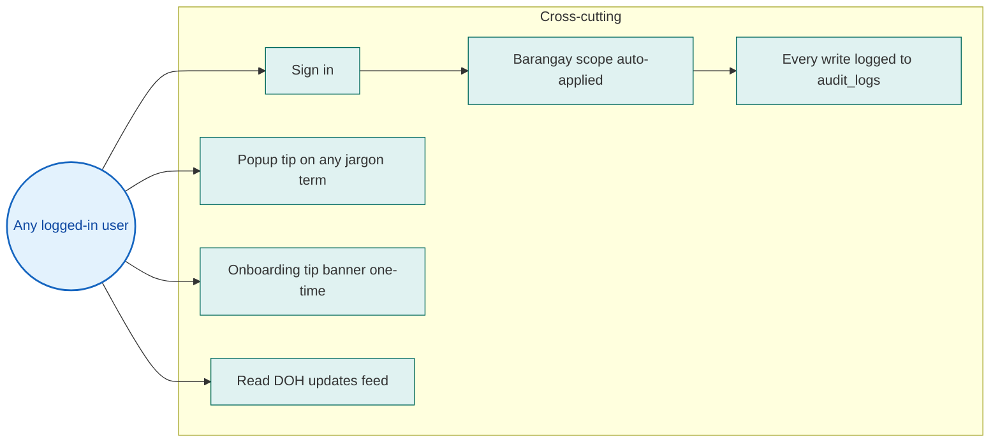

# HealthSync — Use Case Diagram

Companion to [`docs/use-case.md`](./use-case.md). Renders as a UML-style use
case diagram on GitHub via Mermaid. Actors on the outside, use cases grouped
by subsystem, edges show which role can perform which use case.

---

## Master diagram

```mermaid
flowchart LR
    %% ── Actors (left side) ───────────────────────────────────────────────
    TL((TL<br/>Barangay Nurse))
    MHO((MHO<br/>Municipal Health Officer))
    SHA((SHA<br/>Sanitary Health Aide))
    MAYOR((MAYOR))
    HC((HEALTH<br/>COMMITTEE))
    ADMIN((SYSTEM<br/>ADMIN))

    %% ── Subsystem: Mothers ───────────────────────────────────────────────
    subgraph MOTHERS [Mothers]
        UC_M1[Register mother]
        UC_M2[Log ANC visit]
        UC_M3[Log prenatal screening<br/>A-05..A-13]
        UC_M4[Log delivery<br/>B-03/B-04]
        UC_M5[Log PNC checkpoint<br/>C-01a/b/c]
        UC_M6[Log family-planning record<br/>FP-01..FP-12]
    end

    %% ── Subsystem: Children ──────────────────────────────────────────────
    subgraph CHILDREN [Children]
        UC_C1[Register child]
        UC_C2[Log immunization<br/>D1/D2/D3/D4]
        UC_C3[Log sick-child IMCI<br/>F-01..F-03]
        UC_C4[Log nutrition<br/>E-02/E-03a/b]
        UC_C5[Log nutrition follow-up<br/>E-06..E-08]
        UC_C6[Log school immunization<br/>D4-01..03]
    end

    %% ── Subsystem: Seniors / NCD ─────────────────────────────────────────
    subgraph NCD [Seniors and NCD]
        UC_N1[Register senior]
        UC_N2[Log senior med pickup]
        UC_N3[Log PhilPEN assessment<br/>G1-01..f]
        UC_N4[Log NCD screening<br/>G2-01..b]
        UC_N5[Log vision screening<br/>G4-01..03]
        UC_N6[Log cervical screening<br/>G6-01..05b]
        UC_N7[Log mental health screening<br/>G8-01]
        UC_N8[Log oral health visit<br/>ORAL-00..06]
    end

    %% ── Subsystem: Disease Surveillance ──────────────────────────────────
    subgraph DIS [Disease Surveillance]
        UC_D1[Log filariasis exam<br/>DIS-FIL-01..04]
        UC_D2[Log rabies exposure<br/>DIS-RAB-01..05]
        UC_D3[Log schisto / STH / leprosy]
        UC_D4[Log generic disease case<br/>I-01..I-08]
        UC_D5[Update surveillance status<br/>REPORTED to CLOSED]
        UC_D6[Escalate to MGMT inbox]
        UC_D7[Manage outbreak<br/>SUSPECTED to CONTAINED]
    end

    %% ── Subsystem: Mortality ─────────────────────────────────────────────
    subgraph MORT [Mortality]
        UC_X1[Log death event<br/>H-01..H-08]
        UC_X2[Conduct MDR / CDR / PDR review]
    end

    %% ── Subsystem: MGMT Operations ───────────────────────────────────────
    subgraph MGMT [MGMT Operations]
        UC_G1[Review MGMT inbox]
        UC_G2[Process pending referral]
        UC_G3[Process death review queue]
        UC_G4[Process AEFI report]
        UC_G5[Process restock request]
        UC_G6[Process MD review queue]
        UC_G7[Process surveillance escalation]
    end

    %% ── Subsystem: Pharmacy / Inventory ──────────────────────────────────
    subgraph PHARM [Pharmacy and Inventory]
        UC_P1[View stock + stockouts]
        UC_P2[Submit restock request]
        UC_P3[Log dispensing]
        UC_P4[Track cold-chain log]
    end

    %% ── Subsystem: Reporting ─────────────────────────────────────────────
    subgraph RPT [Reporting]
        UC_R1[Generate M1 report<br/>192 rowKeys auto-fill]
        UC_R2[Encode remaining gap rows]
        UC_R3[Submit M1 to RHU]
        UC_R4[Consolidate municipal M1]
        UC_R5[Sign off M1]
        UC_R6[View dashboards]
        UC_R7[Run AI reporting summary]
    end

    %% ── Subsystem: Admin / System ────────────────────────────────────────
    subgraph SYS [Admin and System]
        UC_A1[Manage users]
        UC_A2[Approve KYC]
        UC_A3[View audit logs]
        UC_A4[Curate DOH updates]
        UC_A5[Manage settings + branding]
    end

    %% ── Subsystem: Reference / Awareness ─────────────────────────────────
    subgraph REF [Reference]
        UC_F1[Read DOH updates feed<br/>caraga.doh.gov.ph]
        UC_F2[View glossary]
        UC_F3[Toggle inline definitions]
    end

    %% ── Edges: TL ────────────────────────────────────────────────────────
    TL --> UC_M1
    TL --> UC_M2
    TL --> UC_M3
    TL --> UC_M4
    TL --> UC_M5
    TL --> UC_M6
    TL --> UC_C1
    TL --> UC_C2
    TL --> UC_C3
    TL --> UC_C4
    TL --> UC_C5
    TL --> UC_C6
    TL --> UC_N1
    TL --> UC_N2
    TL --> UC_N3
    TL --> UC_N4
    TL --> UC_N5
    TL --> UC_N6
    TL --> UC_N7
    TL --> UC_N8
    TL --> UC_D1
    TL --> UC_D2
    TL --> UC_D3
    TL --> UC_D4
    TL --> UC_D5
    TL --> UC_X1
    TL --> UC_P1
    TL --> UC_P2
    TL --> UC_P3
    TL --> UC_R1
    TL --> UC_R2
    TL --> UC_R3
    TL --> UC_R6
    TL --> UC_F1
    TL --> UC_F2
    TL --> UC_F3

    %% ── Edges: SHA (surveillance + outbreak field response) ─────────────
    SHA --> UC_D1
    SHA --> UC_D2
    SHA --> UC_D3
    SHA --> UC_D4
    SHA --> UC_D5
    SHA --> UC_D7
    SHA --> UC_F1
    SHA --> UC_F2

    %% ── Edges: MHO (review + signoff + escalations) ─────────────────────
    MHO --> UC_D5
    MHO --> UC_D7
    MHO --> UC_X2
    MHO --> UC_G1
    MHO --> UC_G2
    MHO --> UC_G3
    MHO --> UC_G4
    MHO --> UC_G5
    MHO --> UC_G6
    MHO --> UC_G7
    MHO --> UC_R4
    MHO --> UC_R5
    MHO --> UC_R6
    MHO --> UC_R7
    MHO --> UC_F1
    MHO --> UC_F2

    %% ── Edges: MAYOR + HEALTH_COMMITTEE (view-only) ─────────────────────
    MAYOR --> UC_R6
    MAYOR --> UC_R1
    MAYOR --> UC_G1
    MAYOR --> UC_F1
    MAYOR --> UC_F2
    HC --> UC_R6
    HC --> UC_R1
    HC --> UC_G1
    HC --> UC_F1
    HC --> UC_F2

    %% ── Edges: SYSTEM_ADMIN ──────────────────────────────────────────────
    ADMIN --> UC_A1
    ADMIN --> UC_A2
    ADMIN --> UC_A3
    ADMIN --> UC_A4
    ADMIN --> UC_A5
    ADMIN --> UC_F1
    ADMIN --> UC_F2

    %% ── Styling ──────────────────────────────────────────────────────────
    classDef actor fill:#e3f2fd,stroke:#1565c0,stroke-width:2px,color:#0d47a1
    classDef writeUC fill:#fff8e1,stroke:#f57c00
    classDef readUC fill:#f3e5f5,stroke:#7b1fa2
    classDef adminUC fill:#fce4ec,stroke:#c2185b

    class TL,MHO,SHA,MAYOR,HC,ADMIN actor
    class UC_M1,UC_M2,UC_M3,UC_M4,UC_M5,UC_M6,UC_C1,UC_C2,UC_C3,UC_C4,UC_C5,UC_C6,UC_N1,UC_N2,UC_N3,UC_N4,UC_N5,UC_N6,UC_N7,UC_N8,UC_D1,UC_D2,UC_D3,UC_D4,UC_X1 writeUC
    class UC_D5,UC_D6,UC_D7,UC_X2,UC_G1,UC_G2,UC_G3,UC_G4,UC_G5,UC_G6,UC_G7,UC_R3,UC_R4,UC_R5 adminUC
    class UC_R6,UC_R1,UC_R2,UC_R7,UC_F1,UC_F2,UC_F3,UC_P1,UC_P2,UC_P3,UC_P4 readUC
```

**Legend:**

- 🟦 **Actor** (blue circle) — RBAC role from `shared/models/auth.ts`.
- 🟨 **Write use case** (yellow) — TL-only data entry; gated by `requireRole(UserRole.TL)` on the server.
- 🟪 **Read use case** (purple) — accessible to all authenticated roles (with barangay scope for TLs).
- 🟥 **Workflow / governance use case** (pink) — MHO + admin actions: status transitions, queue processing, M1 sign-off.

---

## Permission notes (server-enforced)

| Use case category | Can perform |
|---|---|
| Patient registry **CREATE** (mother / child / senior / disease / TB) | TL only |
| Patient registry **READ** | All authenticated, TL barangay-scoped |
| Patient registry **UPDATE** | TL + MGMT (`registryRBAC`) |
| Patient registry **DELETE** | SYSTEM_ADMIN only |
| Surveillance row **CREATE** | TL only |
| Surveillance row **status transition** | TL + MGMT |
| MGMT inbox + queue processing | SYSTEM_ADMIN, MHO, SHA, MAYOR, HEALTH_COMMITTEE |
| M1 generate / encode | All authenticated; encoded values audited |
| M1 submit to RHU | TL |
| M1 consolidate / sign-off | MHO + admin |
| User management / KYC / audit logs | SYSTEM_ADMIN only |

`MAYOR` and `HEALTH_COMMITTEE` are **view-only**: they share MGMT's read surface
but every write/transition endpoint rejects them.

---

## Cross-cutting use cases (apply everywhere)

- **Sign in** uses Replit Auth + project-extended `users` table (KYC fields, role, status).
- **Barangay scope auto-applied** is handled by `useBarangay()` + `scopedPath()` on the client and `filterByBarangay()` on the server. TLs see only their assigned barangays; MGMT sees all.
- **Every write logged** — `createAuditLog()` is called by every state-changing endpoint with `before` / `after` JSON.
- **Popup tip** — `<Term name="MAM" />` reads `shared/glossary.ts` and renders click-to-reveal definition with optional source citation. Inline mode is per-user toggle (Account → Display).
- **Onboarding tip banner** — one-time on `/today`, dismissed via localStorage.
- **DOH updates feed** — `/today` card + `/updates` page; sourced from `caraga.doh.gov.ph` (currently seeded; scraper deferred to design).

---

## How a single rabies emergency flows through the diagram

Tracing one of the use-case.md scenarios end-to-end:

1. **TL** → `Log rabies exposure (DIS-RAB-01..05)` — Marvin records Cat III at the BHS.
2. **TL** → `Update surveillance status` — sets to ESCALATED with reviewer notes.
3. The system writes to `audit_logs` (cross-cutting).
4. **MHO** → `Review MGMT inbox` — Dr. Cuyno sees the Surveillance item.
5. **MHO** → `Process surveillance escalation` — opens the row from inbox, takes phone action.
6. **MHO** → `Update surveillance status` — REVIEWED with follow-up plan.
7. End-of-month: **TL** → `Generate M1 report` — DIS-RAB-03 (Cat III) auto-fills.
8. **TL** → `Submit M1 to RHU`.
9. **MHO** → `Consolidate municipal M1` + `Sign off M1`.
10. **MAYOR** → `View dashboards` — sees Honrado trending red on rabies; allocates outreach budget at next session.

All ten steps cross actor boundaries. The audit trail captures every step. The
M1 report at the end is a function of every operator action that month.
